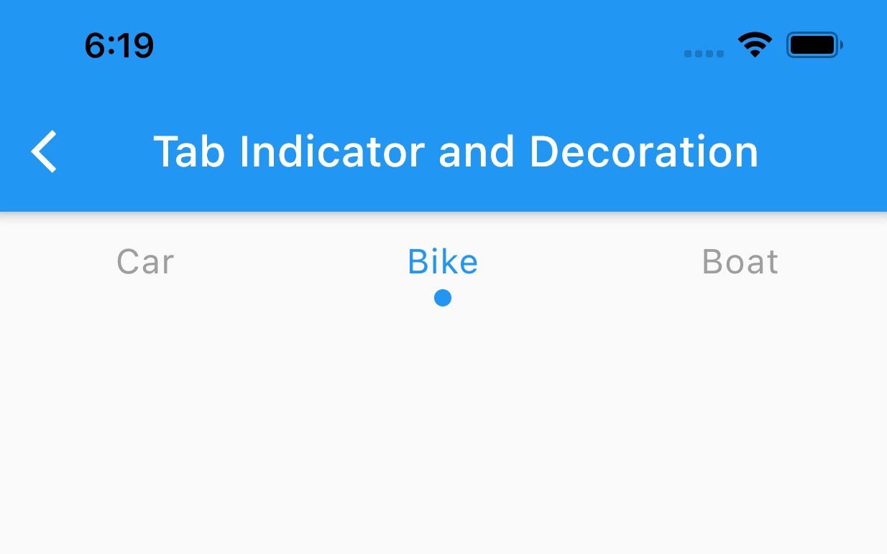
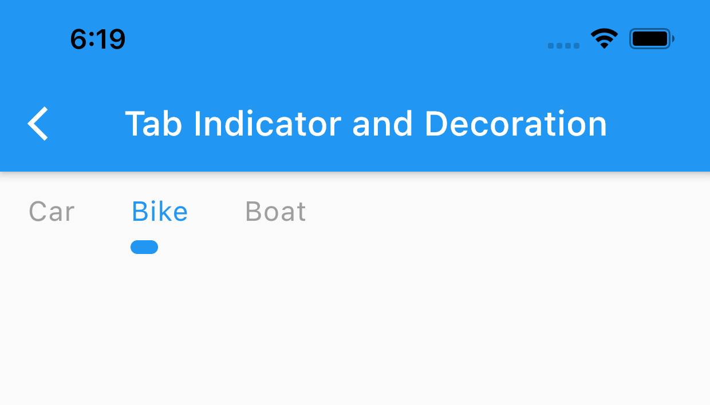
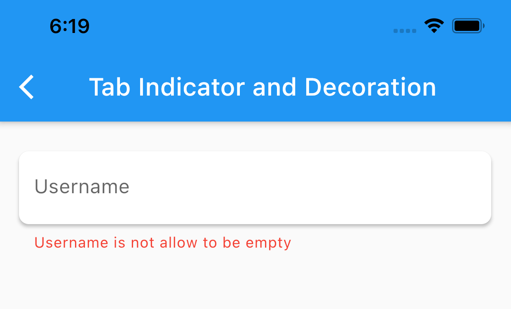

# sura_flutter

[](https://pub.dev/packages/sura_flutter) 

A flutter package from AsurRaa for widgets and utility functions

# Migrate from 2.x to 3.x

- BREAKING CHANGE:

  - remove FutureManager, AsyncSubjectManager, FutureManagerBuilder
  - All manager class now has a separate package

  ```dart
  dependencies:
    sura_manager: any
  ```

# Installation

Add this to pubspec.yaml

```dart
dependencies:
  sura_flutter: ^0.3.1
```

# Widgets

| Widget | Description |
| --- | --- |
| [SuraRaisedButton][buttons] | Custom ElevatedButton with loading notifier |
| [SuraBadge][buttons] | Small badge like notification |
| [SuraActionSheet][other] | Custom CupertinoActionSheet for option selector |
| [ConditionalWidget][other] | Build a widget base on a boolean condition |
| [SuraToolbar][other] | Custom ToolBar or AppBar |
| [SuraFutureHandler][builder_example] | FutureBuilder with less boilerplate code |
| [SuraAccordian][accordion_expandable] | Custom ExpansionTile |
| [SuraExpandable][accordion_expandable] | Similar to SuraAccordion but with different use case |
| [SuraConfirmationDialog][other] | Platform adaptive AlertDialog with cancel and confirm action |
| [SuraAsyncButton][buttons] | Fully customize Material ElevatedButton for asynchronus onPressed callback |
| [SuraLoadingDialog][other] | Create and manage Loading Dialog |
| [SuraPlatformChecker][other] | Platform adaptive widget |
| [SuraSimpleDialog][other] | Simple platform adaptive AlertDialog |
| [SuraListTile][other] | Custom ListTile |
| [SuraPaginatedList][other] | ListView with pagination support |
| [SuraPaginatedGridBuilder][other] | Gridview with pagination support |
| [SuraIconButton][buttons] | Custom IconButton |
| [SuraFlatButton][buttons] | Cusztom TextButton or FlatButton |
| [SpaceX][other] | SizedBox with only width |
| [SpaceY][other] | SizedBox with only height |
| [SuraStreamHandler][builder_example] | A Streambuilder with less boilerplate code |
| [SuraNotifier][builder_example] | A ValueListenableBuilder with less boilerplate code |

[buttons]: https://github.com/asurraa/sura-flutter/tree/master/example/lib/examples/other_buttons_example.dart
[builder_example]: https://github.com/asurraa/sura-flutter/tree/master/example/lib/examples/builder_example.dart
[accordion_expandable]: https://github.com/asurraa/sura-flutter/tree/master/example/lib/examples/sura_accordion_and_sura_expandable.dart
[other]: https://github.com/asurraa/sura_flutter/tree/master/example

# Mixin

### AfterBuildMixin

Create an override method that will call after the build method has been called

```dart
class _HomePageState extends State<NewPage> with AfterBuildMixin {

  //this method will call after widget has been build
  @override
  void afterBuild(BuildContext context) {

  }

  @override
  Widget build(BuildContext context) {
    return Container();
  }
}

```

### SuraFormMixin

Provide some property and method when working with **Form**

#### field and attribute

- **formKey**: a key for form
- **loadingNotifier**: a bool ValueNotifier
- **passwordObsecureNotifier**: a bool ValueNotitifer for toggling password obsecure field
- **isFormValidated**: a bool return by validate **formKey**

#### method

- **toggleLoading**: toggle _loadingNotifier_
- **togglePasswordObsecure**: toggle _passwordObsecureNotifier_

```dart
class _HomePageState extends State<NewPage> with SuraFormMixin {
  @override
  Widget build(BuildContext context) {
    return Scaffold(
      body: Form(key: formKey, child: child)
    );
  }
}
```

### BoolNotifierMixin

Provider a ValueNotifier<bool> and a value toggle function

- **boolNotifier**: a bool ValueNotifier

#### method

- **toggleValue**: toggle _loadingNotifier_

```dart
class _HomePageState extends State<NewPage> with BoolNotifierMixin {
  @override
  Widget build(BuildContext context) {
    return Container();
  }
}
```

# Widget's Extension

### padding, margin

```dart
Text("Hello Flutter").padding(EdgeInsets.all(16.0)) // defaulat value is EdgeInsets.all(8.0)
Text("Hello Flutter").margin(EdgeInsets.all(16.0)) // defaulat value is EdgeInsets.all(8.0)
///As a value
Text("Hello Flutter").marginValue(all: 12)
Text("Hello Flutter").paddingValue(horizontal: 12, vertical: 8)
```

### cssSpacing

```dart
Text("Hello Flutter").cssSpacing(margin: [10,10], padding:[16])
//css margin and padding rule
```

### rotate (in degree)

```dart
Text("Hello Flutter").rotate(45)
```

### flexible, expanded, clipOval, opacity

```dart
Text("Hello Flutter").flexible
Text("Hello Flutter").expanded
Text("Hello Flutter").clipOval
Text("Hello Flutter").opacity(0.5)
```

# TextStyle Extention

```dart
Text("Hello Flutter", style: TextStyle().normal)
Text("Hello Flutter", style: TextStyle().medium)
Text("Hello Flutter", style: TextStyle().bold)
Text("Hello Flutter", style: TextStyle().applyColor(Colors.white))
Text("Hello Flutter", style: TextStyle().applFontSize(24))
```

# Other Extension

### BuildContext extension

```dart
  Size screenSize = context.screenSize;
  Color primaryColor = context.primaryColor;
  Color accentColor = context.accentColor;
  TextTheme textTheme = context.textTheme;
  Theme theme = context.theme;

```

### DateTime extension

```dart
DateTime.now().format(format: "dd mmm yyyy", locale: context.locale)
DateTime.now().isTheSameDay(DateTime.now())
DateTime.now().formatToLocalDate(format: "dd mmm yyyy", locale: context.locale)
```

### String extension

```dart
String name = "chunlee".capitalize() // => Chunlee
```

# Utility and Style

## DotTabIndicator



```dart
  TabBar(
      ...
      indicator: DotTabIndicator(
        color: Colors.blue,
        dotAlignment: TabAlignment.bottom,
      )
      ...
  )
```

## SmallUnderlineTabIndicator



```dart
  TabBar(
      ...
      isScrollable: true, //This indicator work best with scrollable tab bar
      indicator: SmallUnderlineTabIndicator(
        color: Colors.blue,
        paddingLeft: 16,
        alignment: TabAlignment.bottom,
      )
      ...
  )
```

## ShadowInputBorder

This input border solve a problem thath TextField doesn't have a default elevation.



```dart
  TextFormField(
      ...
      decoration: InputDecoration(
        border: ShadowInputBorder(
          elevation: 2.0, //required
          fillColor: Colors.white, //required
          borderRadius: SrauStyle.radius(),
          shadowColor: Colors.black87,
        ),

      )
      ...
  )
```

### SuraColor

```dart

//Get Color from hex string
Color green = SuraColor.fromCode("42f545")

//Get Color from RGB without Alpha or Opacity
Color newColor = SuraColor.fromRGB(8, 182, 155)

//Convert color to MaterialColor
MaterilColor newMaterialColor = SuraColor.toMaterial(0xFF869CF4)
```

### SuraUtils

```dart

//Get byte from asset bundle
Future<Uint8List> imageByte = await SuraUtils.getBytesFromAsset("image asset path", 200); //200 is imagewidth

//Get random image from unsplash
String carUrlImage =  SuraUtils.unsplashImage(width: 200, height: 200, category: "car");

//Get random from picsum with provided: width and height
String randomUrlImage = SuraUtils.picsumImage(200,300);
```

### SuraFormValidator

Provide some field validation

```dart
TextFormField(
validator: (value) => SuraFormValidator.validateField(value, field:"username"),
)
```

### PageNavigator and SuraNavigator

PageNavigator support push, pushReplacement and pushAndRemove method

```dart
PageNavigator.push(context, DetailPage());
PageNavigator.pushReplacement(context, HomePage());
PageNavigator.pushAndRemove(context, RootPage());
```

SuraNavigator also support push, pushReplacement, pushAndRemove without providing a context but you need to add **SuraNavigator.navigatorKey** to MaterialApp

```dart
MaterialApp(
    ...
    navigatorKey: SuraNavigator.navigatorKey,
    ...
    home: MyHomePage(),
)
```

```dart
SuraNavigator.push(DetailPage());
SuraNavigator.pushReplacement(HomePage());
SuraNavigator.pushAndRemove(RootPage());
```

**SuraNavigator also can show dialog without providing a context**

```dart
var result = await SuraNavigator.dialog(MyDialog());
```

### SuraDecoration

```dart
RoundedRectangleBorder roundRectangle = SuraDecoration.roundRect(12);//default value is 8
BorderRadius radius = SuraDecoration.radius(12); //default value is 8
```
